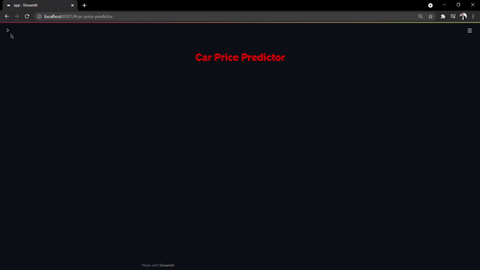

<h1 align='center'> Old-Car-Price-Predictor </h1>
This project aims to predict the price of an used car by taking it's Company name, it's Model name, Year of Purchase, and other parameters using Linear Regression.

---

<h2> How to use the project </h2>

1. Installing the required softwares:-
    ```bash
    pip install -r requirements.txt
    ```
2. Cloning the repository:- 
    ```bash
    git clone https://github.com/mishra1683/Old-Car-Price-Predictor.git
    ```
3. Change the directory:-
    ```bash
    cd Old-Car-Price-Predictor
    ```
4. Run the web app:-
    ```bash
    streamlit run app.py
    ```
5. To close the app from the terminal, press Ctrl+C.

----
# Demonstration
<br>

Demo to use the web page:
<br>



